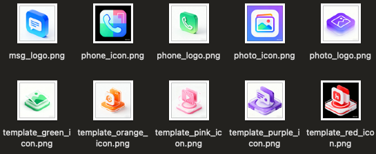
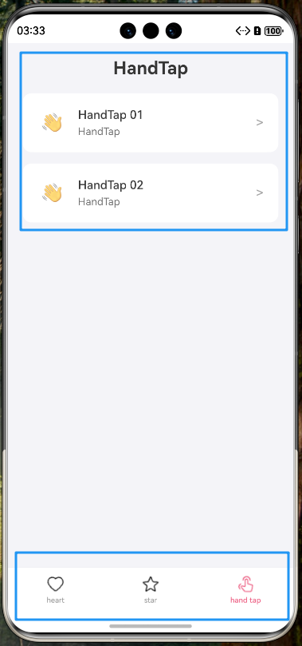
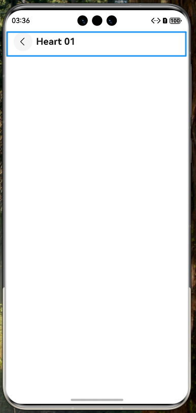
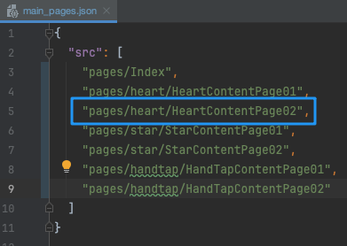
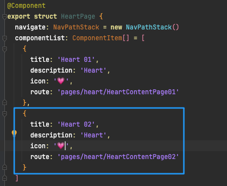

# 鸿蒙学习脚手架

## 1.项目特点（预设内容）

- AI生成的图标



- 应用底部导航栏



- 内容页简单标题



## 2.项目结构

```
entry
├── src
│   ├── main
│   │   ├── ets
│   │   │   ├── components        # 组件目录
│   │   │   │   └── TabBar.ets    # TabBar 组件
│   │   │   ├── entryability      # 入口相关能力目录
│   │   │   ├── entrybackupability # 入口相关能力目录
│   │   │   ├── model             # 数据模型目录
│   │   │   │   ├── componentItem.ets # 组件项数据模型
│   │   │   │   └── tabItem.ets      # Tab 项数据模型
│   │   │   ├── pages             # 页面目录
│   │   │   │   ├── handtap       # HandTap 相关页面
│   │   │   │   │   ├── HandTapContentPage01.ets # HandTap 内容页面 01
│   │   │   │   │   └── HandTapContentPage02.ets # HandTap 内容页面 02
│   │   │   │   ├── heart         # Heart 相关页面
│   │   │   │   │   ├── HeartContentPage01.ets # Heart 内容页面 01
│   │   │   │   │   └── HeartContentPage02.ets # Heart 内容页面 02
│   │   │   │   ├── star          # Star 相关页面
│   │   │   │   │   ├── StarContentPage01.ets # Star 内容页面 01
│   │   │   │   │   └── StarContentPage02.ets # Star 内容页面 02
│   │   │   │   ├── HandTapPage.ets # HandTap 页面
│   │   │   │   ├── HeartPage.ets   # Heart 页面
│   │   │   │   ├── Index.ets       # 首页
│   │   │   │   └── StarPage.ets    # Star 页面
│   │   └── resources             # 资源目录
│   │   │   ├── base              # 基础资源目录
│   │   │   │   ├── element       # 元素资源目录
│   │   │   │   │    ├── color.json  # 颜色配置文件（预设颜色）
│   │   │   │   │    ├── float.json  # 浮点数值配置文件
│   │   │   │   │    └── string.json # 字符串配置文件
│   │   │   │   ├── media             # 媒体资源目录（预设图片资源）
│   │   │   │   ├── profile           
│   │   │   │   │    ├── backup_config.json
│   │   │   │   │    └── main_pages.json    # 主页面配置文件
│   │   │   │   └─ rawfile                   # 源文件目录
```


## 3.快速开始

- 克隆本仓库

`git clone https://github.com/Yeluzii/Harmony_Template.git`

- 在各导航页创建新内容项（以HeartPage为例）

先在 `pages/heart` 文件夹中新建页面 `HeartContentPage02.ets`，确认在 `resources/base/profile/main_pages.json`文件中确实有该页



接着，在 `pages/HeartPage` 中，配置组件项即可


